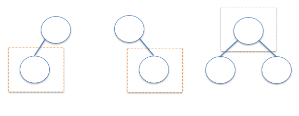

##  1123. Lowest Common Ancestor of Deepest Leaves

### Topic
Hash Table / *Tree* / *Depth-First Search* / Breadth-First Search / *Binary Tree*

### Idea  
先想Case會有哪些情況，就如圖片其實也就這三種狀況，比較左右子樹的深度 `depth`，藉由遞迴得方式去往下搜尋找到 leaves，比較左右 leaf 的深度，
「深度」概念上是說「從目前這個 root 出發，能夠走到的最深深度」，並且對每個節點都去詢問左右子樹，每邊都問：「你最深的葉節點在哪裡？你這一邊的答案是誰？」，
所以可以保證正確找到「所有最深葉子的最低公共祖先」。


### Time Complexity & Space Complexity
Time : O(n)  
Space : O(h), worst O(n), Best O(log n)
### Code
```
/**
 * Definition for a binary tree node.
 * struct TreeNode {
 *     int val;
 *     TreeNode *left;
 *     TreeNode *right;
 *     TreeNode() : val(0), left(nullptr), right(nullptr) {}
 *     TreeNode(int x) : val(x), left(nullptr), right(nullptr) {}
 *     TreeNode(int x, TreeNode *left, TreeNode *right) : val(x), left(left), right(right) {}
 * };
 */
class Solution {
public:
    TreeNode* lcaDeepestLeaves(TreeNode* root) {
        return dfs(root).first;
    }
    pair<TreeNode*, int> dfs(TreeNode* root){
        if(!root) return {nullptr, 0};

        auto [leftNode, leftDepth] = dfs(root->left);
        auto [rightNode, rightDepth] = dfs(root->right);

        if (leftDepth > rightDepth) return {leftNode, leftDepth + 1};  //case1
        if (rightDepth > leftDepth) return {rightNode, rightDepth + 1}; // case2
        return {root, leftDepth + 1}; //case 3
    }
};
```
